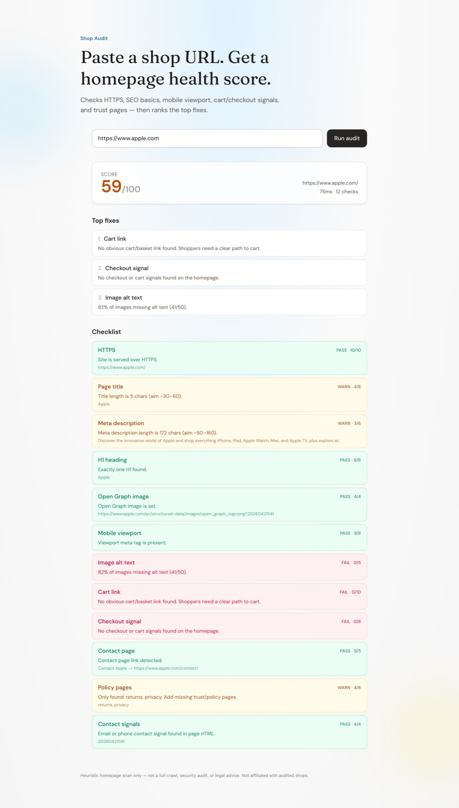
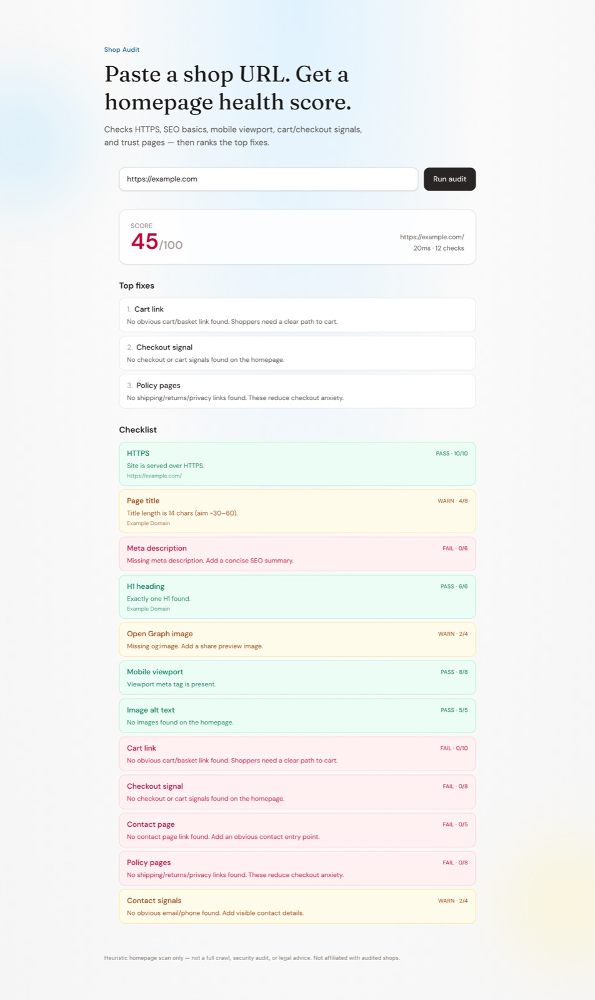

# Shop Audit

Paste an ecommerce URL → get a **homepage health score** plus a checklist and top fixes.

**Live demo:** [https://shop-audit-beta.vercel.app](https://shop-audit-beta.vercel.app)






Heuristic scan of the public homepage only (SEO basics, mobile viewport, cart/checkout signals, trust/policy pages). Not a full crawl, security audit, or legal advice.

## Features

- Weighted score 0-100
- 12 automated checks
- Top 3 actionable fixes
- Simple rate-limited API

## Stack

Next.js (App Router) · TypeScript · Cheerio · Vitest · Tailwind CSS

## Quick start

```bash
npm install
npm run dev
```

Open [http://localhost:3000](http://localhost:3000).

```bash
npm test
npm run build
```

## API

`POST /api/audit`

```json
{ "url": "https://example-shop.com" }
```

Returns an `AuditReport` JSON object (`percent`, `checks`, `topFixes`, …).

Sample: [`examples/sample-report.json`](examples/sample-report.json)

## Scoring (MVP)

| Area | Examples |
|------|----------|
| Security | HTTPS |
| SEO | title, meta description, H1, og:image |
| Mobile | viewport |
| Images | alt coverage |
| Commerce | cart link, checkout signal |
| Trust | contact, policy pages, email/phone |

`pass` = full weight · `warn` = half · `fail` = 0

## Limits

- Homepage HTML only (no product catalog crawl)
- Best-effort in-memory rate limit (5/min/IP on a single instance)
- Some sites block bots: fetch may fail; the UI still shows a report
- Not affiliated with audited shops

## License

MIT
